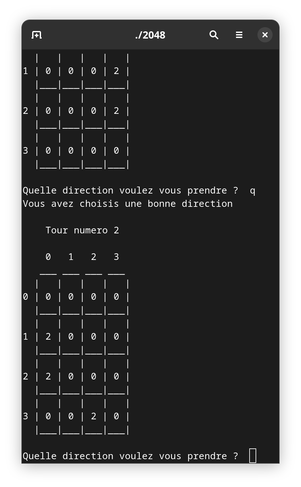

# 2048 Game

This is a command-line implementation of the popular game 2048, written in C as a school project in 2020.

# Screenshot

# How to Play

You can move the numbers by pressing the following keys:

* z: Move the tiles up
* q: Move the tiles left
* s: Move the tiles down
* d: Move the tiles right

When two tiles with the same number touch, they merge into one!

To quit the game at any time, press Ctrl-C.

# How to Install

To install and run the game, follow these steps:

1. Clone the repository or download the source code files.
2. Open a terminal or command prompt and navigate to the directory containing the source code files.
3. Run the following command to compile the code: gcc *.c -o 2048
4. After the compilation is complete, run the game by entering: ./2048

Note that you must have GCC installed on your computer in order to compile the code.

# Credits

This implementation of 2048 was written by Ilyas Turki for a school project in 2020.